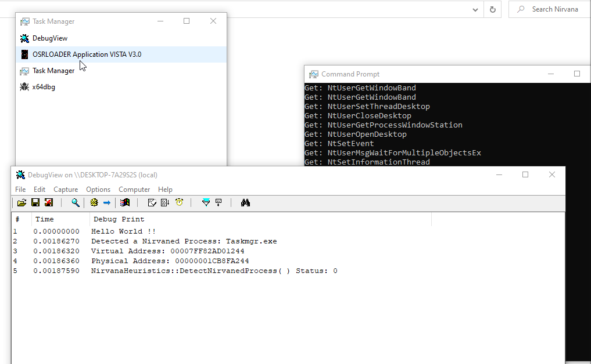
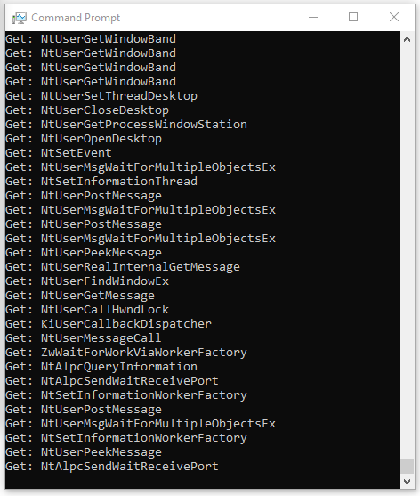

# Instrumentation Callback ToolKit
 
 
 A fast method to intercept syscalls from any user-mode process using InstrumentationCallback and detect any process using InstrumentationCallback. 

##### The project is divided into two parts:

SmellsLikeKernelSpirit - It is responsible for installing an instrumentation callback in the target process through DLL injection (usually from the currently running main thread).

DetectProcessContainerNirvaned - It is responsible for detecting a process container with an instrumentation callback installed in any operating system process.

#### Using DetectProcessContainerInstrumented:

You can compile and use it in your heuristics to detect whether your user-land process or which user-land processes are using the resource.

 

#### Using SmellsLikeKernelSpirit(x86 and x64):

You can download precompiled binaries and their respective debug files from the 'release' tab of this repository to avoid the need for compilation (and directly intercept).

When injecting, a console will be allocated for the process and will capture any of the system calls used by it.

Exemple:

 

